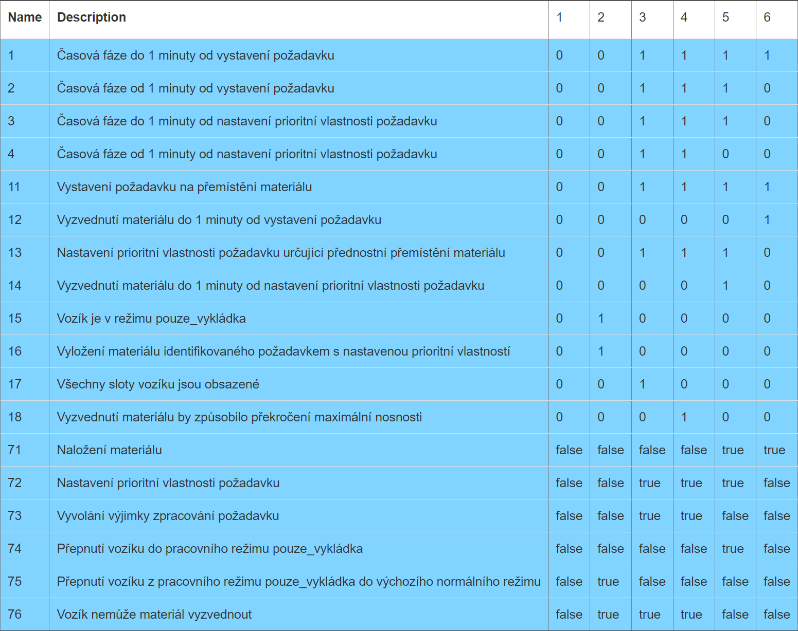
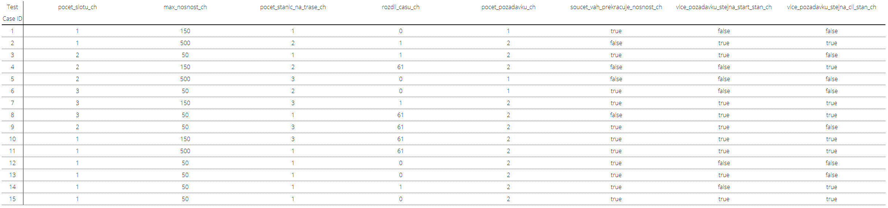

# Dokumentace testů

Autor: Dominik Nejedlý (xnejed09)

## Graf přícin a důsledků (CEG)

K vytvoření grafu byl využit nástroj: [Ceg](http://ceg.testos.org/). Výsledná konfigurace pro tento nástroj se nachází v souboru `ceg.json`.

### Graf příčin a důsledů (screenshot z nástroje [Ceg](http://ceg.testos.org/))

")

### Výsledná rozhodovací tabulka (screenshot z nástroje [Ceg](http://ceg.testos.org/))

## Identifikace vstupních parametrů

| Identifikátor     | Popis                                                          |
| :---------------: | -------------------------------------------------------------- |
| `pocet_slotu`     | Počet slotů vozíku                                             |
| `max_nosnost`     | Maximální nosnost vozíku                                       |
| `cas_pozadavku`   | Naplánovaný čas vystavení požadavku                            |
| `pocet_pozadavku` | Celkový počet naplánovaných požadavků                          |
| `start_stanice`   | Počáteční stanice požadavku (stanice, kde je materiál naložen) |
| `cil_stanice`     | Cílová stanice požadavku (stanice, kde je materiál vyložen)    |
| `vaha_pozadavku`  | Váha požadavku (váha meteriálu, který má být převezen)         |

## Charakteristiky parametrů

### `pocet_slotu`

| `pocet_slotu_ch` | Počet slotů vozíku                   |
| :--------------: | :----------------------------------: |
| 1                | `pocet_slotu = 1`                    |
| 2                | `pocet_slotu = 2`                    |
| 3                | `pocet_slotu = 3 or pocet_slotu = 4` |

### `max_nosnost`

| `max_nosnost_ch` | Maximální nosnost vozíku (kg) |
| :--------------: | :---------------------------: |
| 1                | `max_nosnost = 50`            |
| 2                | `max_nosnost = 150`           |
| 3                | `max_nosnost = 500`           |

- `max_nosnost_ch.1 -> !pocet_slotu_ch.1`
- `max_nosnost_ch.3 -> !pocet_slotu_ch.3`

### `cas_pozadavku`

| `rozdil_casu_ch` | Alespoň 2 požadavky jsou naplánovány s daným rozdílem časů (`rozdil_casu`) na stejný čas |
| :--------------: | :--------------------------------------------------------------------------------------: |
| 1                | `rozdil_casu = 0`                                                                        |
| 2                | `rozdil_casu > 0 and rozdil_casu <= 60`                                                  |
| 2                | `rozdil_casu > 60`                                                                       |

### `pocet_pozadavku`

| `pocet_pozadavku_ch` | Celkový počet naplánovaných požadavků |
| :------------------: | :-----------------------------------: |
| 1                    | `pocet_pozadavku = 1`                 |
| 2                    | `pocet_pozadavku > 1`                 |

- `pocet_pozadavku_ch.1 -> rozdil_casu_ch.1`

### `start_stanice` a `cil_stanice`

| `pocet_stanic_na_trase_ch` | Celkový počet různých stanic na trase (`pocet_stanic_na_trase`) alespoň jednoho požadavku (včetně počáteční a cílové) |
| :------------------------: | :-------------------------------------------------------------------------------------------------------------------: |
| 1                          | `pocet_stanic_na_trase = 1` (`start_stanice = cil_stanice`)                                                           |
| 2                          | `pocet_stanic_na_trase = 2` (`start_stanice != cil_stanice` a na trase není žádná mezistanice)                        |
| 3                          | `pocet_stanic_na_trase > 2` (`start_stanice != cil_stanice` a na trase je alespoň mezistanice)                        |

| `vice_pozadavku_stejna_start_stan_ch` | Alespoň 2 požadavky jsou naplánovány ze stejné počáteční stanice |
| :-----------------------------------: | :--------------------------------------------------------------: |
| 1                                     | `true`                                                           |
| 2                                     | `false`                                                          |

- `vice_pozadavku_stejna_start_stan_ch.1 -> pocet_pozadavku_ch.2`

| `vice_pozadavku_stejna_cil_stan_ch` | Alespoň 2 požadavky jsou naplánovány do stejné cílové stanice |
| :---------------------------------: | :-----------------------------------------------------------: |
| 1                                   | `true`                                                        |
| 2                                   | `false`                                                       |

- `vice_pozadavku_stejna_cil_stan_ch.1 -> pocet_pozadavku_ch.2`

### `vaha_pozadavku`

| `soucet_vah_prekracuje_nosnost_ch` | Součet vah všech naplánvaných požadavků (`soucet_vah`) překračuje maximální nosnost vozíku |
| :--------------------------------: | :----------------------------------------------------------------------------------------: |
| 1                                  | `true` (`soucet_vah > max_nosnost`)                                                        |
| 2                                  | `false` (`soucet_vah <= max_nosnost`)                                                      |

## Kombinace všech dvojic bloků

K vytvoření kombinací byl využit nástroj: [Combine](https://combine.testos.org/). Výsledná konfigurace pro tento nástroj se nachází v souboru `combine.json`.

*Poznámka: Testovací případy 12, 13, 14, a 15 (vygenerované nástrojem [Combine](https://combine.testos.org/)) nesplňují definovaná omezení (vozík s maximální nosností 50 kg nemůže mít pouze jeden slot). Je tedy možné že daný nástroj nepracuje zcela správně.*

### Tabulka kombinací všech dvojic bloků (screenshot z nástroje [Combine](https://combine.testos.org/))

## Implementované testy

K implementaci bylo vybráno celkem 15 testů (5 z výsledné CEG rozhodovací tabulky a 10 z tabulky kombinací všech dvojic bloků).

### Tabulka udávající vybrané testovací případy z výsledné CEG rozhodovací tabulky a jejich výsledky

| Testovací případ | Test (příslušná metoda)   | Výsledek testu |
| :--------------: | :-----------------------: | :------------: |
| 1                | `test_no_request`         | Úspěšný        |
| 3                | `test_all_slots_taken`    | Úspěšný        |
| 4                | `test_overload`           | Úspěšný        |
| 5                | `test_load_request`       | Úspěšný        |
| 6                | `test_load_prior_request` | Úspěšný        |

### Tabulka udávající vybrané testovací případy z výsledné tabulky kombinací všech dvojic bloků a jejich výsledky

| Testovací případ                   | Test (příslušná metoda)   | Výsledek testu |
| :--------------------------------: | :-----------------------: | :------------: |
| 1                                  | `test_combine_1`          | Úspěšný        |
| 2                                  | `test_combine_2`          | Úspěšný        |
| 3                                  | `test_combine_3`          | Úspěšný        |
| 4                                  | `test_combine_4`          | Úspěšný        |
| 5                                  | `test_combine_5`          | Úspěšný        |
| 8                                  | `test_combine_8`          | Úspěšný        |
| 9                                  | `test_combine_9`          | Úspěšný        |
| 10                                 | `test_combine_10`         | Úspěšný        |
| 11                                 | `test_combine_11`         | Úspěšný        |
| 12 (s upraveným počtem slotů na 2) | `test_combine_12`         | Neúspěšný      |

*Poznámka: Testovací případ 12 plánuje 2 požadavky na vyzvednutí materiálu na stejný čas. To však ústí v chybu: `Cart is busy: Status.Loading`. Ta je vyvolána dvěma překrývajícími se pokusy o vyzvednutí jednoho z těchto požadavků. V programu se tedy nejspíše nachází chyba, která onen druhý požadavek na vyzvednutí toho samého materiálu zapříčiní.*
