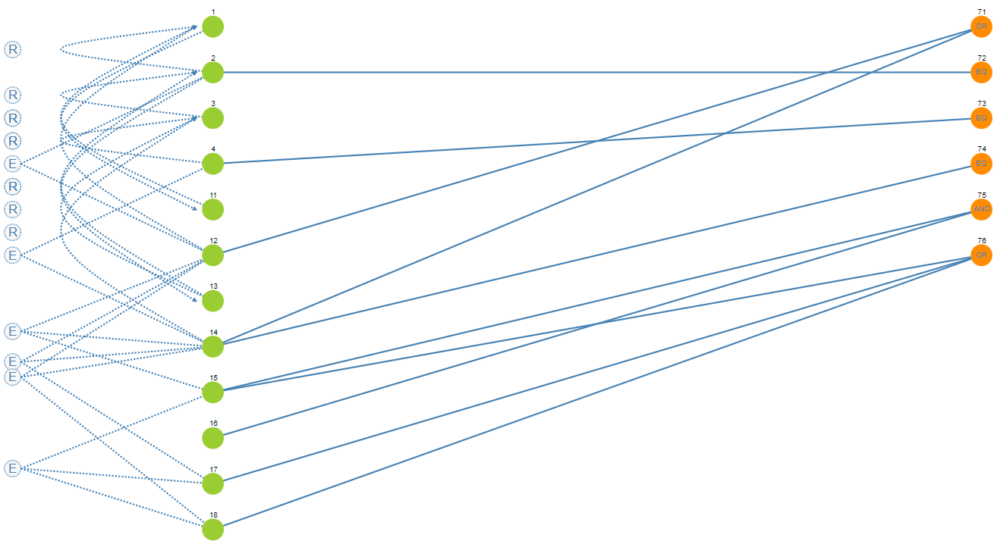

# Dokumentace testů

Autor: Dominik Nejedlý (xnejed09)

## Graf přícin a důsledků (CEG)

K vytvoření grafu byl využit nástroj: [Ceg](http://ceg.testos.org/). Výsledná konfigurace pro tento nástroj se nachází v souboru `ceg.json`.

### Graf příčin a důsledů (screenshot z nástroje [Ceg](http://ceg.testos.org/))

### Výsledná rozhodovací tabulka (screenshot z nástroje [Ceg](http://ceg.testos.org/))

## Identifikace vstupních parametrů

| | |
|-|-|
| | |

## Charakteristiky parametrů

## Kombinace všech dvojic bloků

K vytvoření kombinací byl využit nástroj: [Ceg](https://combine.testos.org/). Výsledná konfigurace pro tento nástroj se nachází v souboru `combine.json`.

### Tabulka kombinací všech dvojic bloků (screenshot z nástroje [Combine](https://combine.testos.org/))

